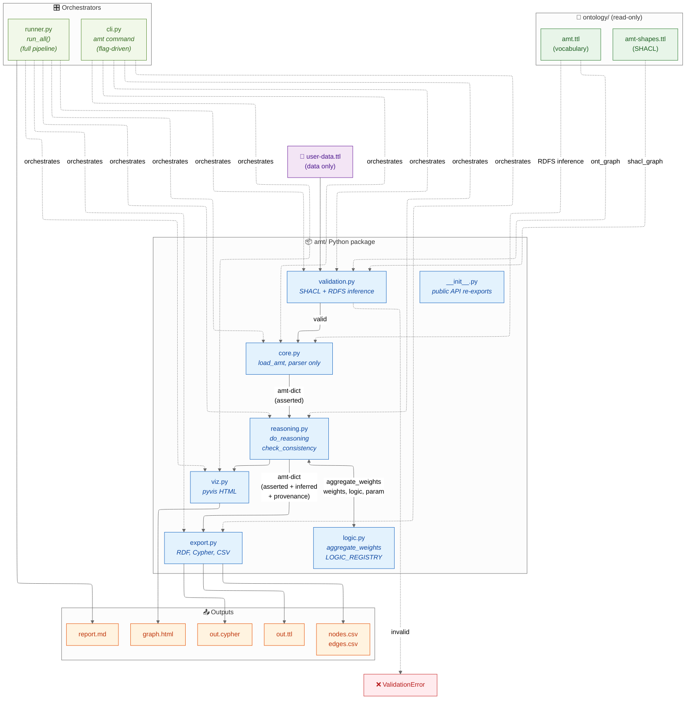

# AMT.engine

**Academic Meta Tool — Reasoning Engine**

A pure-Python reasoner for the [Academic Meta Tool](http://academic-meta-tool.xyz/)
ontology. Reads a Turtle file with concepts, roles and weighted assertions,
applies fuzzy-logic role-chain inference and integrity checks, and exports
the resulting graph as RDF, Cypher, CSV or interactive HTML.

## Features

- **SHACL pre-validation** of input files against the bundled
  `ontology/amt-shapes.ttl`. Catches malformed axioms before they reach
  the reasoner.
- **n-ary RoleChainAxioms** via `amt:antecedents` (an RDF list of
  arbitrary length). Legacy 2-step `antecedent1`/`antecedent2` form is
  also accepted.
- **Six fuzzy-logic operators** through one unified `aggregate_weights`
  API, registry-based for easy extension: Gödel, Product, Łukasiewicz,
  Einstein, Geometric Mean, Hamacher.
- **Provenance tracking** — every inferred edge knows which axiom IRIs
  contributed to its derivation. When an edge can be reached through
  multiple axioms, their IRIs are merged into a single provenance list.
- **Four output formats** — RDF/Turtle (round-trip-compatible),
  Neo4J Cypher, two-file CSV (nodes + edges) and a self-contained
  interactive HTML graph.
- **Markdown run reports** that document every pipeline run alongside
  its outputs, so old result folders stay self-describing.

## Architecture



## Layout

```
amt/                        pip-installable package
├── __init__.py             public API re-exports
├── core.py                 load_amt, parser only
├── reasoning.py            do_reasoning, check_consistency
├── logic.py                aggregate_weights, LOGIC_REGISTRY
├── validation.py           validate_against_shapes (SHACL wrapper)
├── export.py               export_ttl, export_cypher, export_csv
├── viz.py                  pyvis HTML visualisation
├── cli.py                  the `amt` command
└── runner.py               the `amt-runner` command (full pipeline)

ontology/                   formal AMT specification
├── amt.ttl                 vocabulary
├── amt-shapes.ttl          SHACL shapes
├── examples/               valid + invalid example data files
└── validate_examples.py    standalone validation demo

examples/                   sample TTL inputs to play with
tests/                      pytest test suite
pyproject.toml              build config + entry points
```

## Quickstart

```bash
git clone <repo-url> amt.engine
cd amt.engine
python -m venv .venv
. .venv/bin/activate                   # Windows: .\.venv\Scripts\activate
pip install -e ".[dev]"
pytest tests/ -q                       # all green
```

Then run the bundled SKOS-mapping example through the full pipeline:

```bash
amt-runner examples/skos-mapping-example.ttl
# or, equivalently:
python -m amt.runner examples/skos-mapping-example.ttl
```

This validates the file, loads it, runs the consistency check and the
reasoner, then writes six files into `examples/out/`:

```
skos-mapping-example.reasoned.ttl     RDF/Turtle, asserted + inferred
skos-mapping-example.cypher           Neo4J Cypher
skos-mapping-example.nodes.csv        flat tabular nodes
skos-mapping-example.edges.csv        flat tabular edges (with provenance)
skos-mapping-example.html             interactive graph
skos-mapping-example.report.md        human-readable run report
```

The output folder is cleared at the start of every run, so it always
reflects the most recent pipeline.

## What the pipeline does

1. **Validate** the input against `ontology/amt-shapes.ttl` (SHACL).
   Refuses to proceed on a malformed file.
2. **Load** the data: parse Concepts, Roles, Nodes, Edges and Axioms.
   The bundled `ontology/amt.ttl` is loaded automatically as an RDFS
   inference graph, so input files don't need to redeclare the vocabulary.
3. **Reason** to a fixed point: every RoleChain and Inverse axiom is
   applied iteratively until no new edges are produced.
4. **Check consistency** by evaluating Disjoint and SelfDisjoint axioms
   against the reasoned edge set.
5. **Export** the result as TTL, Cypher, CSV and HTML.
6. **Write a Markdown run report** documenting what happened.

## Library use

```python
from amt import load_amt, do_reasoning, check_consistency, export_csv

amt = load_amt("my-data.ttl", validate=True)        # raises if invalid
reasoned = do_reasoning(amt["edges"], amt["axioms"])
inferred = [e for e in reasoned if e["inferred"]]

ok, violations = check_consistency(amt["edges"], amt["axioms"])

nodes_csv, edges_csv = export_csv(
    amt["nodes"], amt["edges"], amt["axioms"],
    "output/", with_reasoning=True, prefix="my-data",
)
```

For the full pipeline in one call:

```python
from amt.runner import run_all
amt = run_all("my-data.ttl", output_dir="out/")
```

Each inferred edge has an `inferred=True` flag and a `provenance` list
of axiom IRIs. Asserted edges have `inferred=False` and an empty
provenance list.

## CLI

The `amt` command is flag-driven — use it for selective steps:

```bash
amt input.ttl --validate-only                 # just SHACL check, exit 0/1
amt input.ttl --info                          # print ontology summary
amt input.ttl --reason --check                # reason + integrity check
amt input.ttl --reason \
    --export-ttl out.ttl \
    --export-csv out/ \
    --export-cypher out.cypher \
    --export-html graph.html
```

The `amt-runner` command runs everything at once and writes a report.
Use the equivalent `python -m amt.runner` form if you don't want to rely
on the installed entry point.

## Fuzzy-logic operators

Pick any of the six operators with `amt:logic` on a `RoleChainAxiom`:

```turtle
ex:RCA a amt:RoleChainAxiom ;
    amt:antecedents ( ex:knows ex:trusts ex:knows ) ;
    amt:consequent  ex:trusts ;
    amt:logic       amt:GeometricMean .         # n-ary, no parameter

ex:RCA_Hamacher a amt:RoleChainAxiom ;
    amt:antecedents    ( ex:knows ex:trusts ) ;
    amt:consequent     ex:trusts ;
    amt:logic          amt:HamacherProduct ;
    amt:logicParameter "2.0"^^xsd:decimal .     # gamma > 1 = softer than product
```

| Operator              | Arity   | Recommended for          |
|-----------------------|---------|--------------------------|
| `amt:GoedelLogic`     | binary  | curated mappings, n=2..3 |
| `amt:ProductLogic`    | binary  | independent evidence, n=2 |
| `amt:LukasiewiczLogic`| binary  | strict reasoning, n=2 only |
| `amt:EinsteinProduct` | binary  | medium-confidence, n=3..4 |
| `amt:GeometricMean`   | n-ary   | comparing chains, n≥4 |
| `amt:HamacherProduct` | binary  | tunable, research |

Adding a new operator means one entry in `amt/logic.py`'s
`LOGIC_REGISTRY` plus a matching `amt:Logic` instance in
`ontology/amt.ttl`. See the [ontology README](ontology/README.md)
for the full vocabulary specification.

## Input format at a glance

A minimal AMT data file declares concepts, roles, instances, weighted
assertions and at least one axiom:

```turtle
@prefix amt:  <http://academic-meta-tool.xyz/vocab#> .
@prefix rdf:  <http://www.w3.org/1999/02/22-rdf-syntax-ns#> .
@prefix rdfs: <http://www.w3.org/2000/01/rdf-schema#> .
@prefix xsd:  <http://www.w3.org/2001/XMLSchema#> .
@prefix ex:   <http://example.com/> .

ex:Person a amt:Concept ;
    rdfs:label "Person" ;
    amt:placeholder "Lastname, Firstname" .

ex:knows a amt:Role ;
    rdfs:label "knows" ;
    rdfs:domain ex:Person ;
    rdfs:range  ex:Person .

ex:alice amt:instanceOf ex:Person ; rdfs:label "Alice" .
ex:bob   amt:instanceOf ex:Person ; rdfs:label "Bob" .

_:a1 rdf:subject   ex:alice ;
     rdf:predicate ex:knows ;
     rdf:object    ex:bob ;
     amt:weight    "0.9"^^xsd:decimal .

ex:RCA a amt:RoleChainAxiom ;
    amt:antecedents ( ex:knows ex:knows ) ;
    amt:consequent  ex:knows ;
    amt:logic       amt:GoedelLogic .
```

The `ontology/` folder defines the full vocabulary and SHACL shapes —
any tool that wants to consume or produce AMT-compatible data can rely
on those files alone.

## Bundled examples

| File | Purpose |
|------|---------|
| `examples/chain-test.ttl` | Minimal Alice/Bob/Carol/Dave chain — useful for understanding what reasoning produces from a simple input. |
| `examples/skos-mapping-example.ttl` | SKOS concept mapping across Getty AAT, Wikidata and project-internal vocabularies. Exercises all six logic operators, both inverse and integrity axioms, and demonstrates merged provenance. |
| `ontology/examples/example-valid.ttl` | Smallest possible file that passes SHACL validation. |
| `ontology/examples/example-invalid.ttl` | Deliberately broken file used in the validation tests; produces exactly four expected SHACL violations. |
