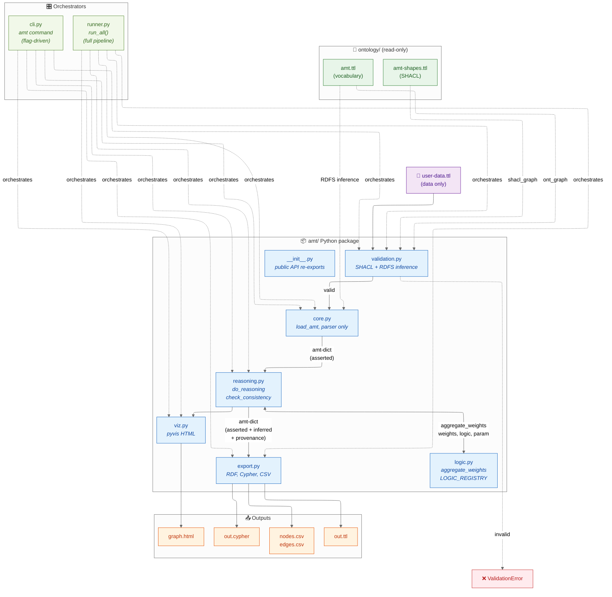

# AMT — Academic Meta Tool (Python edition v2)

Pure-Python implementation of the [Academic Meta Tool](http://academic-meta-tool.xyz/),
rebuilt around the formal AMT ontology in [`ontology/`](ontology/).

## What's new in v2

- **SHACL pre-validation** of input files against `ontology/amt-shapes.ttl`.
  Catches malformed axioms before they reach the reasoner.
- **n-ary RoleChainAxioms** via `amt:antecedents` (an RDF list).
  Legacy 2-ary `antecedent1`/`antecedent2` form still accepted.
- **Six fuzzy-logic operators** through one unified `aggregate_weights(...)`
  API, registry-based for easy extension:
  Gödel, Product, Łukasiewicz, Einstein, Geometric Mean, Hamacher.
- **Provenance tracking** — every inferred edge knows which axiom IRIs
  contributed to its derivation.
- **Three export formats** — RDF/Turtle, Neo4J Cypher, two-file CSV
  (`nodes.csv` + `edges.csv`).

## Architecture



## Layout

```
amt/                        pip-installable package
├── __init__.py             public API re-exports
├── core.py                 load_amt, parser only
├── reasoning.py            do_reasoning, check_consistency
├── logic.py                aggregate_weights, LOGIC_REGISTRY
├── validation.py           validate_against_shapes (SHACL wrapper)
├── export.py               export_ttl, export_cypher, export_csv
├── viz.py                  pyvis HTML visualisation
├── cli.py                  the `amt` command
└── runner.py               the `amt-runner` command (full pipeline)

ontology/                   read-only — formal AMT specification
├── amt.ttl                 vocabulary
├── amt-shapes.ttl          SHACL shapes
├── examples/               valid + invalid example data files
└── validate_examples.py    standalone validation demo

tests/                      pytest smoke tests
examples/                   sample TTL inputs
pyproject.toml              build config + entry points
```

## Quickstart

```bash
pip install -e ".[dev]"
pytest tests/ -v                       # 30 tests, all green

# Full pipeline in one command
amt-runner examples/chain-test.ttl

# Or step-by-step via the flag-driven CLI
amt examples/chain-test.ttl --validate-only         # just SHACL check
amt examples/chain-test.ttl --info                  # ontology summary
amt examples/chain-test.ttl --reason --check        # reason + integrity
amt examples/chain-test.ttl --reason \
    --export-ttl out.ttl \
    --export-csv out/ \
    --export-cypher out.cypher \
    --export-html graph.html
```

## Library use

```python
from amt import load_amt, do_reasoning, check_consistency, export_csv

amt = load_amt("my-data.ttl", validate=True)        # raises if invalid
reasoned = do_reasoning(amt["edges"], amt["axioms"])
inferred = [e for e in reasoned if e["inferred"]]

ok, violations = check_consistency(amt["edges"], amt["axioms"])

nodes_csv, edges_csv = export_csv(
    amt["nodes"], amt["edges"], amt["axioms"],
    "output/", with_reasoning=True,
)
```

## Six fuzzy-logic operators

Use any of the six operators in a `RoleChainAxiom` via `amt:logic`:

```turtle
ex:RCA a amt:RoleChainAxiom ;
    amt:antecedents ( ex:knows ex:trusts ex:knows ) ;
    amt:consequent  ex:trusts ;
    amt:logic       amt:GeometricMean .       # n-ary, no parameter

ex:RCA_Hamacher a amt:RoleChainAxiom ;
    amt:antecedents     ( ex:knows ex:trusts ) ;
    amt:consequent      ex:trusts ;
    amt:logic           amt:HamacherProduct ;
    amt:logicParameter  "2.0"^^xsd:decimal .   # gamma > 1 = softer than product
```

| Operator              | Arity   | Recommended for       |
|-----------------------|---------|-----------------------|
| `amt:GoedelLogic`     | binary  | curated mappings, n=2..3 |
| `amt:ProductLogic`    | binary  | independent evidence, n=2 |
| `amt:LukasiewiczLogic`| binary  | strict reasoning, n=2 only |
| `amt:EinsteinProduct` | binary  | medium-confidence, n=3..4 |
| `amt:GeometricMean`   | n-ary   | comparing chains, n>=4 |
| `amt:HamacherProduct` | binary  | tunable, research |

Adding a new operator means one line in
[`amt/logic.py`'s `LOGIC_REGISTRY`](amt/logic.py) plus a matching entry in
`ontology/amt.ttl`.

## Validation example

```bash
amt ontology/examples/example-invalid.ttl --validate-only
# Output:
# VAL Validating example-invalid.ttl ...
# FAIL  Validation failed with 4 violation(s):
#   [1] amt:weight must be a single xsd:decimal in [0, 1]
#   [2] InverseAxiom must have exactly one amt:inverse
#   [3] RoleChainAxiom using HamacherProduct must specify logicParameter
#   [4] Cannot mix legacy and modern antecedents
```

## Migration from v0.1.x

If you used the previous version as a library, two imports moved:

```python
# v1
from amt.core import do_reasoning, check_consistency

# v2
from amt.reasoning import do_reasoning, check_consistency
# (or just `from amt import do_reasoning, check_consistency` — re-exported)
```

Edge dicts gained two fields: `inferred: bool` and `provenance: list[str]`.
Existing code that iterates edges with `e["weight"]` etc. is unaffected.

The `_conjunction(x, y, logic)` private function was replaced by
`aggregate_weights(weights, logic, parameter)` in `amt.logic`. If you
called the private API, switch to the new one.
