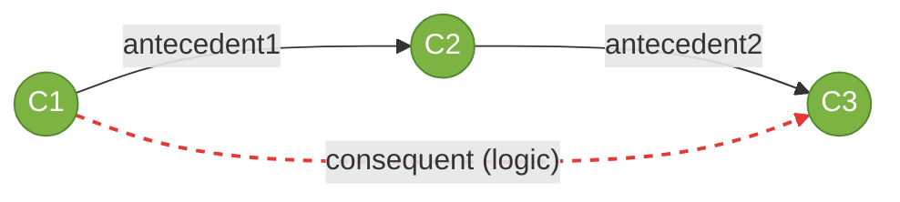
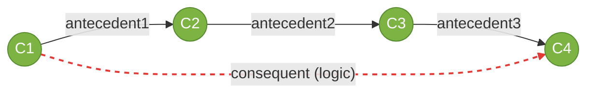
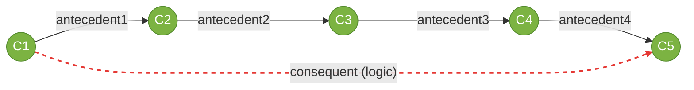
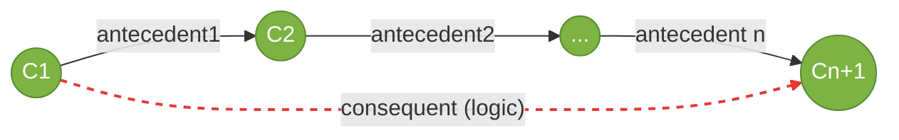

# Role Chain Axiom Diagrams

Visualisations of `amt:RoleChainAxiom` for different chain lengths.

The classical (2-ary) form is shown alongside the n-ary generalisation
introduced in the extended Leonard Edition. Black solid arrows are
asserted antecedent edges; the red dashed arrow is the inferred consequent.

---

## 2-ary (classical)



```turtle
@prefix amt:     <http://academic-meta-tool.xyz/vocab#> .
@prefix rdf:     <http://www.w3.org/1999/02/22-rdf-syntax-ns#> .
@prefix example: <http://example.com/> .

amt:rca rdf:type        amt:RoleChainAxiom .
amt:rca amt:antecedents ( amt:Role amt:Role ) .
amt:rca amt:consequent  amt:Role .
amt:rca amt:logic       amt:Logic .
```

> **Backwards compatibility:** the legacy form using `amt:antecedent1` and
> `amt:antecedent2` is also supported.

---

## 3-ary



```turtle
@prefix amt:     <http://academic-meta-tool.xyz/vocab#> .
@prefix rdf:     <http://www.w3.org/1999/02/22-rdf-syntax-ns#> .
@prefix example: <http://example.com/> .

amt:rca3 rdf:type        amt:RoleChainAxiom .
amt:rca3 amt:antecedents ( amt:Role amt:Role amt:Role ) .
amt:rca3 amt:consequent  amt:Role .
amt:rca3 amt:logic       amt:Logic .
```

> **Recommended logic:** Gödel (default). Alternatives: Einstein product or
> geometric mean.

---

## 4-ary



```turtle
@prefix amt:     <http://academic-meta-tool.xyz/vocab#> .
@prefix rdf:     <http://www.w3.org/1999/02/22-rdf-syntax-ns#> .
@prefix example: <http://example.com/> .

amt:rca4 rdf:type        amt:RoleChainAxiom .
amt:rca4 amt:antecedents ( amt:Role amt:Role amt:Role amt:Role ) .
amt:rca4 amt:consequent  amt:Role .
amt:rca4 amt:logic       amt:Logic .
```

> **Recommended logic:** geometric mean (default). Alternatives: Gödel or
> Einstein product. Product logic is not recommended at n=4 — it dampens
> the result too aggressively.

---

## n-ary (general)



```turtle
@prefix amt:     <http://academic-meta-tool.xyz/vocab#> .
@prefix rdf:     <http://www.w3.org/1999/02/22-rdf-syntax-ns#> .
@prefix example: <http://example.com/> .

amt:rcaN rdf:type        amt:RoleChainAxiom .
amt:rcaN amt:antecedents ( amt:Role amt:Role amt:Role amt:Role amt:Role ) .  # n roles
amt:rcaN amt:consequent  amt:Role .
amt:rcaN amt:logic       amt:Logic .

# Optional for parametrised logics (e.g. Hamacher):
# amt:rcaN amt:logicParameter "2.0"^^xsd:decimal .
```